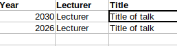

# Zatman Updater
This tool updates the HTML website for the SEDI webpage.

# Usage
To use the tool run
```
python GUI.png
```

Alternatively, the dist folder contains a zip archive with a compiled
.exe version of the Zatman updater.

It was created by the pyinstaller command below.

# Dependencies
Uses
- tkinter
- os
- configparser

from the standard library.

Also uses
- pandas

The python distribution Anaconda comes with all dependencies installed.

# Compilation instructions
Can be compiled to exe with the following pyinstaller command.
```
pyinstaller -i "gui.ico" --noconsole --onefile --add-data "gui.png;." GUI.py
```

# Use example on Linux


The tool can read a given excel spreadsheet with three columns(Year, Lecturer
and Title) and create the Zatman html from it.

Given for example:



The result will look like this.


